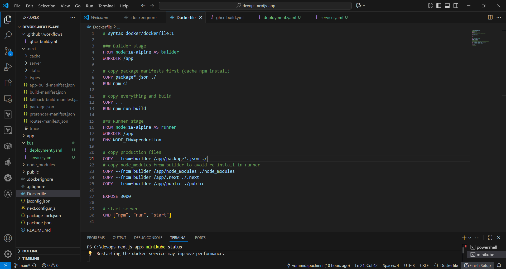

# DevOps Internship Assessment: Containerize and Deploy a Next.js Application

## Objective
This project demonstrates the containerization of a Next.js application, automated build and push to GitHub Container Registry (GHCR) via GitHub Actions, and deployment on Minikube using Kubernetes manifests.

---

## Quick Overview
1. Local Next.js app (`devops-nextjs-app/`)  
2. Dockerfile and .dockerignore  
3. Kubernetes manifests (`k8s/` folder: deployment.yaml & service.yaml)  
4. GitHub Actions workflow (`.github/workflows/ghcrbuild.yml`)  
5. Screenshots documenting the process  

---

## Step 1: Create Next.js App

- Created the project using `npx create-next-app@latest`  
- Tested locally on [http://localhost:3000](http://localhost:3000)  

  
  
  
  

---

## Step 2: Dockerize the Application

- Created `.dockerignore` and `Dockerfile` for containerization  
- Built Docker image and ran locally  
- Verified container and app accessibility  

  
  
  
  
  

---

## Step 3: GitHub Repository

- Created public GitHub repo: `devops-nextjs-app`  
- Pushed initial Next.js app, Dockerfile, and Kubernetes manifests  

  
  

---

## Step 4: GHCR Personal Access Token (PAT)

- Created PAT for pushing images to GHCR  
- Added secret `CR_PAT` to GitHub repository  

  
  

---

## Step 5: GitHub Actions Workflow

- Configured workflow to build Docker image and push to GHCR  
- Verified workflow run and GHCR image creation  

  
  
  

---

## Step 6: Kubernetes Manifests

- Created `k8s/deployment.yaml` and `k8s/service.yaml`  
- Deployment includes replicas, health checks, and resource limits  

  
  
  

---

## Step 7: Deploy to Minikube

- Started Minikube using Docker driver  
- Applied Kubernetes manifests  
- Verified pods and services  

  
  
  
  
  

---

## Step 8: Cleanup

- Stopped and removed all local Docker containers/images and terminated Minikube  

  
  
  

---

## Conclusion

This project successfully:

- Containerized a Next.js app with Docker  
- Automated builds and pushes to GHCR using GitHub Actions  
- Deployed the containerized app to Minikube using Kubernetes manifests  

It demonstrates a **complete CI/CD workflow** integrating local development, containerization, automation, and Kubernetes deployment.
